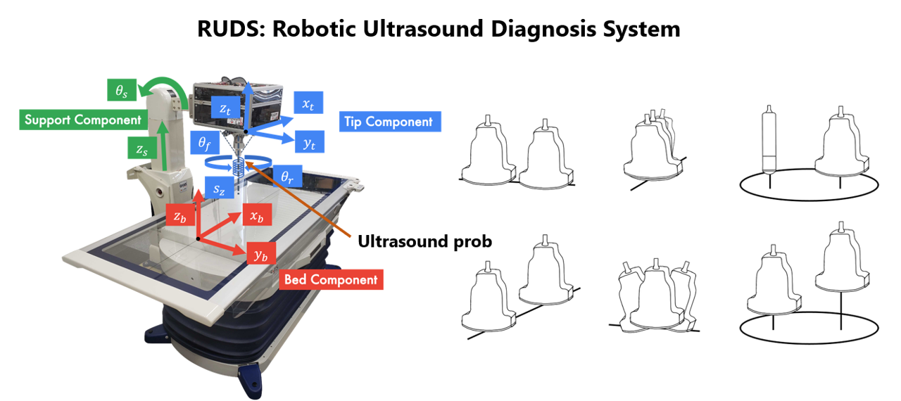
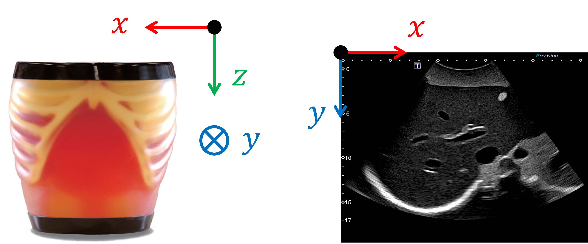
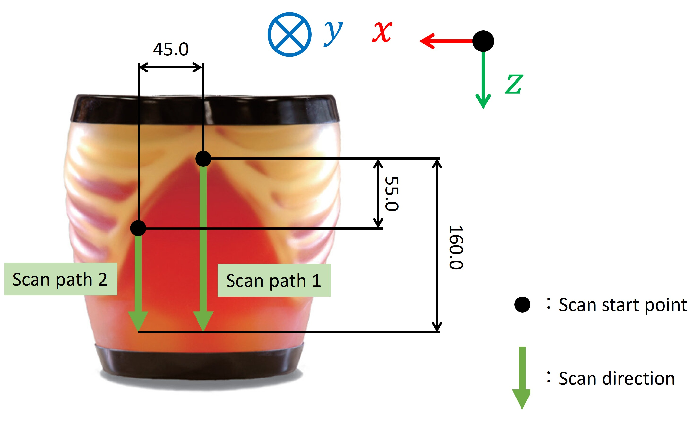
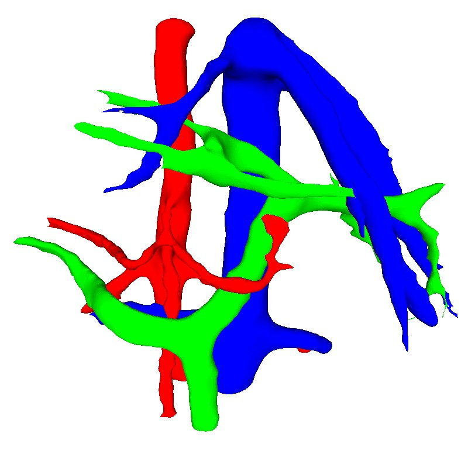

# 超音波診断ロボット(RUDS)を用いた血管3Dモデル構築

## 概要 (Overview)

本リポジトリでは、超音波診断ロボット（RUDS: Robotic Ultrasound Diagnosis System）を用いて構築した超音波診断ファントム「ABDFAN」（京都科学製）の血管3Dモデルおよび構築手法について公開します。

### 背景と目的
自らの実験において超音波診断ファントムABDFANの3Dモデル（特に血管構造）が必要でしたが、公式から公開されているものがありませんでした。また、以下の理由により従来の医用画像モダリティでは正確な3Dモデルの構築が困難でした：

* **MRI撮影の制約:** ファントム内部に金属部品が含まれており、金属アーチファクトによりMRI撮影が困難。
* **CTコントラスト不足:** CTスキャンではファントム内の血管と周囲組織の輝度差が乏しく、正確なセグメンテーションが困難。

そのため、本研究では**超音波画像のみを用いた3Dモデル構築手法**を提案し、ロボット制御による高精度スキャンと画像処理技術を組み合わせることで、血管3Dモデルの構築に成功しました。本リポジトリでは、この手法および構築したデータセットを公開し、同様の課題を持つ研究者の参考に供します。

## システム構成 (System Configuration)


*Fig 1. 超音波診断ロボットRUDS / Robotic Ultrasound Diagnosis System (RUDS)*

* **ロボット:** RUDS (Robotic Ultrasound Diagnosis System)
* **ファントム:** 超音波診断ファントム "ABDFAN" (株式会社京都科学製)
* **座標系:** ロボットベッド部を$z$軸（頭尾方向）に移動させながら、アキシャル面($xy$平面)の超音波画像を取得しています。


*Fig 2. 座標系定義*

## 構築手法 (Methodology)

### 1. データ取得 (Data Acquisition)
ロボット制御により、以下のプロトコルで高精度なスキャンを実施しました。

* **Tilting (プローブ傾斜):** 肋骨の音響陰影を避けるため、プローブを15.0°傾斜させて固定。
* **Scanning Path (走査経路):**
    * **Path 1:** $z$軸方向に **0.5mm 間隔** でスキャン。
    * **Offset:** 1列目の終了後、ロボット手先を$x$軸（横）方向に **45.0mm**、$z$軸方向に55.0mm移動。
    * **Path 2:** 2列目を同様に0.5mm間隔でスキャン。


*Fig 3. スキャン経路およびオーバーラップの概要*


*Fig 4. RUDSによる肝臓スキャンの様子 (a) スキャン開始位置 (b) Path 1 (c) Path 2 / Liver scan with RUDS (a) Scan starting point (b) Path 1 (c) Path 2*

### 2. 画像結合 (Image Stitching)
広範囲な肝臓断面を得るため、Path 1とPath 2の画像を結合しています。
ロボットのエンコーダ値による幾何学的な結合では、ファントム表面の凹凸によるプローブ圧着時の微細なズレが生じるため、**テンプレートマッチング**を用いて重複領域の最適化を行いました。

### 3. 3D再構築 (3D Reconstruction)
* **アノテーション:** 結合画像に対し、血管（動脈・静脈・門脈）および腫瘍を手動でラベリング（Labelmeを使用）。
* **点群生成:** 画像上のピクセル座標($x, y$)とロボットのエンコーダ値($z$)を統合し、3次元点群データを生成。
* **メッシュ処理:** 点群解析ソフト（MeshLab）を使用し、外れ値除去、ボクセルグリッドフィルタ、Screened Poisson Surface Reconstruction、およびスムージング処理を実施して最終的なメッシュモデルを構築しました。

**注意事項:** ロボットの機械的精度やプローブとファントム表面の接触状態により、サブミリメートルオーダーの位置誤差が含まれる可能性があります。本データセットは、この誤差を考慮した上での利用を想定しています。

以下は構築された3Dモデルの例です。


*Fig 5. 再構築された血管3Dモデル*

## データセットの仕様 (Dataset Specifications)

**注記:** データセット（生データ、結合画像、3Dモデル）は容量の都合上、Google Driveにて管理しています。利用をご希望の方は、以下の「データセットの入手方法」セクションをご参照ください。

### データセット構成
本データセットには以下のデータが含まれます：

#### 1. 各パスから取得した画像データ（`raw_path_images/`）
* Path 1およびPath 2で取得した超音波画像（未結合）
* フォーマット: `.png`
* 0.5mm間隔でスキャンした連続画像

#### 2. テンプレートマッチングで結合したスライス画像（`stitched_images/`）
* Path 1とPath 2を結合した広範囲断面画像
* フォーマット: `.png`
* テンプレートマッチングによる最適化
* **アノテーションデータ（`stitched_images/annotations/`）:**
  - 血管部および高エコー腫瘍部がアノテーションされたLabelme形式のJSONファイル
  - 血管クラス別に分類済み（動脈、静脈、門脈）
  - 高エコー腫瘍部のラベルづけを含む
  - 各スライス画像に対応するアノテーション情報を含む

#### 3. 血管3Dモデル（`vascular_models/`）
以下の3種類の血管構造について、点群モデルおよびメッシュモデルを提供：
* **動脈 (Arteries)**
* **静脈 (Veins)**
* **門脈 (Portal Veins)**

各構造について：
* 点群モデル: `*_pointcloud.ply`
* メッシュモデル: `*_mesh.ply`

フォーマット: `.ply` (Polygon File Format)

### 固定パラメータ
本データセットは、以下の固定パラメータに基づいて構築されています。
* **ピクセルスペーシング:** **41 pixels / 10 mm** (固定)
* **スライス厚:** 0.5 mm

### 精度に関する注記
ロボット制御システムにより高精度なスキャンを実現していますが、以下の要因により微小な誤差が含まれます：
* ロボットアームの機械的な位置決め精度の限界
* ファントム表面の凹凸によるプローブ接触位置のばらつき
* 超音波画像に起因する空間分解能の限界

これらの誤差は、臨床応用を想定した研究や評価実験においては許容範囲内と考えられますが、高精度な幾何学的解析を行う際にはご留意ください。

## データセットの入手方法 (Access)

以下の共有リンクよりデータセットをダウンロードできます：

[データセットダウンロードリンク (Google Drive)](https://drive.google.com/drive/folders/1IKDcU-3xiZ5du3VjPjEODqiD3TJz0OSK?usp=sharing)

### 利用規約 (Terms of Use)
本データセットをご利用いただく際は、以下の条件を遵守してください：

* **利用目的:** 本データセットは研究・教育目的でのみ利用可能です。
* **再配布の禁止:** 本データセットを第三者に再配布することは禁止されています。
* **目的外使用の禁止:** 上記の目的以外での使用はお控えください。

本データセットの利用により生じた一切の損害について、作成者は責任を負いかねますのでご了承ください。

## ライセンス (License)

本データセットは **CC BY-NC 4.0（クリエイティブ・コモンズ 表示-非営利 4.0 国際）** ライセンスの下で提供されます。

[](https://creativecommons.org/licenses/by-nc/4.0/)

詳細については [CC BY-NC 4.0 ライセンス](https://creativecommons.org/licenses/by-nc/4.0/deed.ja) をご参照ください。

## 文献 (Citation)

本手法が掲載された学会誌を以下に示します。

**論文:**
> 笠置 陸, 小泉憲裕, 西山 悠, 梅津菜央, 藤井 樹, 沼田和司, 松本直樹, 小川眞広, 小路 直, 津村遼介. "3D モデルに基づく磁気センサを必要としない肝腫瘍超音波治療効果判定システムの構築." 日本超音波医学会 第97回学術集会, *超音波医学* 51, Supplement (2024): S736-S736.

**BibTeX:**
```bibtex
@article{Kasagi2024,
  title={3D モデルに基づく磁気センサを必要としない肝腫瘍超音波治療効果判定システムの構築},
  author={笠置 陸 and 小泉憲裕 and 西山 悠 and 梅津菜央 and 藤井 樹 and 沼田和司 and 松本直樹 and 小川眞広 and 小路 直 and 津村遼介},
  journal={超音波医学},
  volume={51},
  number={Supplement},
  pages={S736--S736},
  year={2024},
  month={4},
  note={日本超音波医学会 第97回学術集会}
}